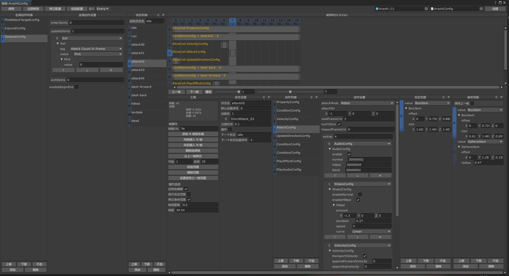
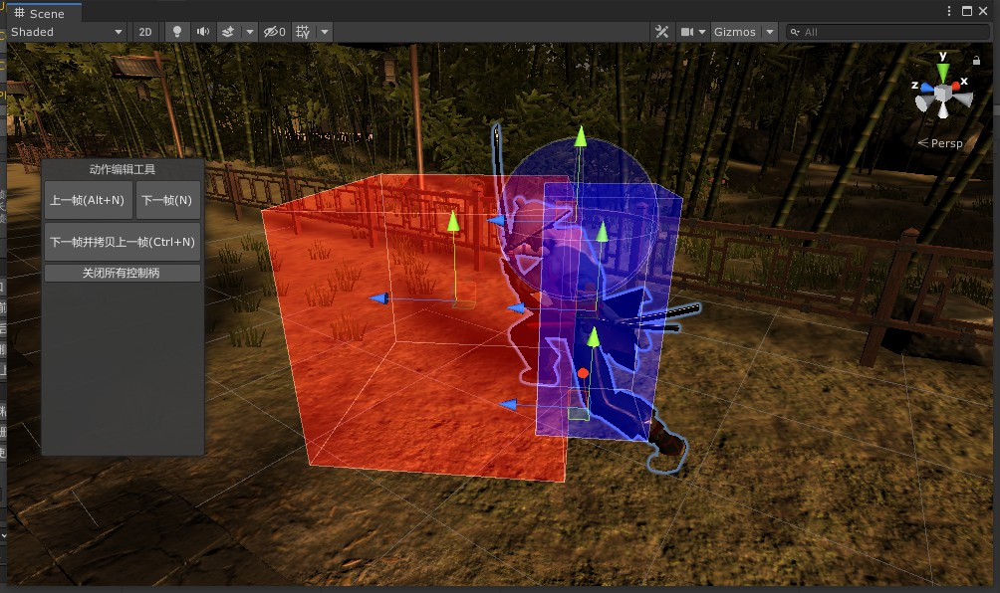

# XMLib 动作游戏编辑器

- 逐帧动作编辑
- 逻辑与表现分离
- 动作逻辑实现简单
- 可用于帧同步
- 支持2D与3D

## 依赖

- [XMLib.Common](https://github.com/PxGame/XMLib.Common)
    - [XMLib.ThirdParty](https://github.com/PxGame/XMLib.ThirdParty)

## 安装方式

 1. 克隆本库及其依赖库到工程中使用
 2. 如果你是git工程，则可将本库及其依赖库作为子库添加到你的git工程
 3. 在 `<工程根目录>/Packages/manifest.json` 文件中添加如下配置，unity即可自动导入本库及其依赖

    ```json
    {
        "dependencies": {
                "com.peterxiang.xmlib.thirdparty": "https://github.com/PxGame/XMLib.ThirdParty.git",
                "com.peterxiang.xmlib.common": "https://github.com/PxGame/XMLib.Common.git",
                "com.peterxiang.xmlib.am": "https://github.com/PxGame/XMLib.AM.git"
        }
    }
    ```

## 操作界面

 - 数据编辑窗口
 

 - 受击框和攻击框编辑工具
 

## 技术交流

- 欢迎大家前来交流技术及提出建议

<a target="_blank" href="https://qm.qq.com/cgi-bin/qm/qr?k=ddtfWymCeKb7s1SqWXN3kw9HLF_RwP2B&jump_from=webapi">QQ群：1044192401</a>